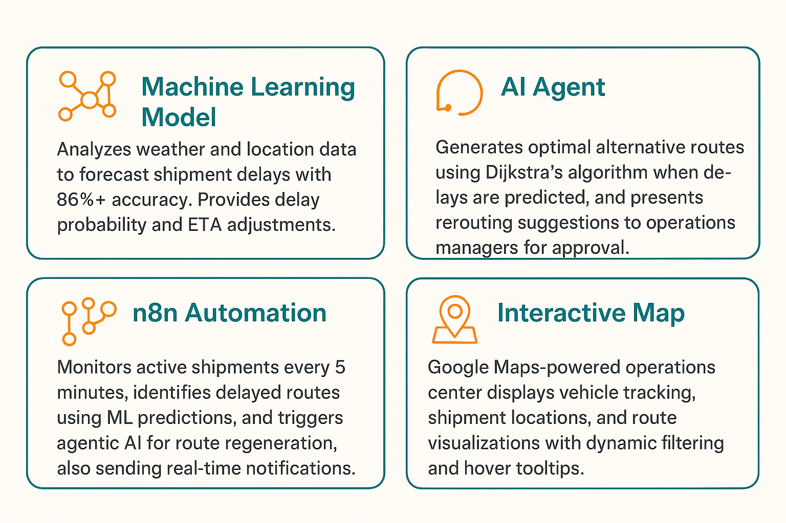
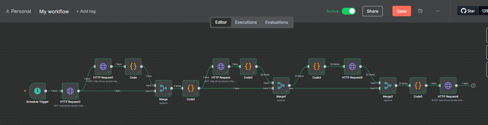

  

<!-- project overview -->

CargoSmart is an AI-powered intelligent logistics platform that leverages machine learning and agentic AI to autonomously optimize delivery routes, predict delays, and automate shipment management decisions in real-time.

  

<!-- System Design -->

### Cargo Smart – Software Architecture

  

### Cargo Smart - Class diagram

[View on Eraser](https://app.eraser.io/workspace/hUhaIbwbfGFrjAfvHiIM)

  

  

<!-- Project Highlights -->

### Main Features

  

- Machine Learning Model that analysis weather, and location data to forecast shipment delays with 86%+ accuracy. The machine learning classifier processes multiple environmental factors to provide both delay probability and ETA adjustments.
- AI Agent that generates optimal alternative routes using Dijkstra's algorithm when delays are predicted, and presents rerouting suggestions to operations managers for approval.
- N8N automation engine that monitors all active shipments every 5 minutes, identifies delayed routes using ML predictions, and automatically triggers the agentic AI for route regeneration, also sending real-time notifications to drivers.
- Interactive Google Maps-powered operations center that displays vehicle tracking, shipment locations, and route visualizations with dynamic filtering and hover tooltips. The live map provides route polylines, and multi-theme support (light, dark, satellite, terrain) for comprehensive logistics oversight.

  

<!-- Demo -->

### Operations Manager Screens (Web)

<table style="width:100%; table-layout:fixed;">
  <tr>
    <td style="width:50%;">Login screen</td>
    <td style="width:50%;">Shipments screen</td>
  </tr>
  <tr>
    <td style="width:50%; vertical-align:top;">
      
    </td>
    <td style="width:50%; vertical-align:top;">
      
    </td>
  </tr>
</table>

<table style="width:100%; table-layout:fixed;">
  <tr>
    <td style="width:50%;">Map screen</td>
  </tr>
  <tr>
    <td style="width:50%; vertical-align:top;">
        
    </td>
  </tr>
</table>

<table style="width:100%; table-layout:fixed;">
  <tr>
    <td>Vehicles screen</td>
    <td>Routes screen</td>
  </tr>
  <tr>
    <td>
      
    </td>
    <td style="width:50%; vertical-align:top;">
      
    </td>
  </tr>
</table>

<table style="width:100%; table-layout:fixed; margin-top:20px;">
  <tr>
    <td>Reroute screen</td>
  </tr>
  <tr>
    <td>
      
    </td>
  </tr>
</table>

  

### User Screens (Mobile)

<table>
  <tr>
    <td>Login screen</td>
    <td>Shipments screen</td>
    <td>Mark As Delivered screen</td>
  </tr>
  <tr>
    <td></td>
    <td></td>
    <td></td>
  </tr>
</table>

### Admin Screens (Web)

<table style="width:100%; table-layout:fixed; margin-top:20px;">
  <tr>
    <td>Users screen</td>
    <td>Groups screen</td>
  </tr>
  <tr>
    <td>
      
    </td>
    <td>
      
    </td>
  </tr>
</table>

<table style="width:100%; table-layout:fixed; margin-top:20px;">
  <tr>
    <td>Permissions screen</td>
    <td>Group Permissions screen</td>
  </tr>
  <tr>
    <td>
      
    </td>
    <td>
      
    </td>
  </tr>
</table>

  

<!-- Development & Testing -->

<table>
  <tr>
    <td>Services</td>
    <td>Validation</td>
    <td>Testing</td>
  </tr>
  <tr>
    <td></td>
    <td></td>
    <td></td>
  </tr>
</table>

### Machine Learning

  

#### Delay Prediction — Summary

`train_delay_model.py` trains a delay classifier using a Scikit‑learn `LogisticRegression` inside a preprocessing `Pipeline` (imputation + scaling for numeric, one‑hot for categorical). Features include geospatial distance, temporal signals, and simple weather flags. Data comes from `data/delivery_truck_data.xlsx` with an 80/20 stratified split. The trained model is saved to `models/delay_classifier.joblib` and plots to `models/plots/`.

- **ROC‑AUC**: 0.841 • **PR‑AUC**: 0.914 • **F1**: 0.797
- **Accuracy**: 0.75 (support: 1,278)
- Confusion matrix shown above (`confusion_matrix.png`).

### Dataset

The dataset used in this project is published: [Enhanced Delivery Truck Trips Dataset with Routes and Weather](https://zenodo.org/records/17185680).

This dataset contains enriched delivery truck trip records. The base data was originally obtained from the Kaggle Delivery Truck Trips Dataset.

To extend the dataset’s analytical value, two additional data sources were integrated:

- **Routes**: Calculated using the OpenRouteService API, providing geographical routing information.
- **Weather**: Historical weather data retrieved via the OpenWeatherMap API, giving environmental context to each trip.

This combination allows researchers and practitioners to explore the impact of routes and weather conditions on delivery logistics and performance.

### N8N Automation

<table>
  <tr>
    <td>N8N Automation</td>
  </tr>
  <tr>
    <td>
        
    </td>
  </tr>
  <tr>
    <td>
        
    </td>
  </tr>
</table>

### Project Management (Linear)

- Overview of how tasks were organized and tracked throughout the project.

<table>
  <tr>
    <td>Linear</td>
  </tr>
  <tr>
    <td>
        
    </td>
  </tr>
</table>

  

<!-- Deployment -->

### Swagger API Documentation

- Interactive API docs for backend services
- Groups: Web Authentication, User Management, Mobile Authentication, Mobile Shipments,...
- Tips:
  - Mobile: login to get a token, then Authorize with Bearer token
  - Web: get CSRF, then login; session cookies are used

<table style="width:100%; table-layout:fixed; margin-top:10px;">
  <tr>
    <td>Swagger API 1</td>
    <td>Swagger API 2</td>
    <td>Swagger API 3</td>
  </tr>
  <tr>
    <td></td>
    <td></td>
    <td></td>
  </tr>
</table>
