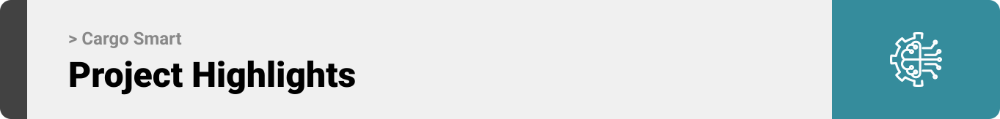

  

<!-- project overview -->

CargoSmart is an AI-powered intelligent logistics platform that leverages machine learning and agentic AI to autonomously optimize delivery routes, predict delays, and automate shipment management decisions in real-time.

  

<!-- System Design -->

### Cargo Smart – Software Architecture

### Cargo Smart - Class diagram

[View on Eraser](https://app.eraser.io/workspace/hUhaIbwbfGFrjAfvHiIM)

  

<!-- Project Highlights -->

### Main Features

- Machine Learning Model that analysis weather, and location data to forecast shipment delays with 86%+ accuracy. The machine learning classifier processes multiple environmental factors to provide both delay probability and ETA adjustments.
- AI Agent that generates optimal alternative routes using Dijkstra's algorithm when delays are predicted, and presents rerouting suggestions to operations managers for approval.
- N8N automation engine that monitors all active shipments every 5 minutes, identifies delayed routes using ML predictions, and automatically triggers the agentic AI for route regeneration, also sending real-time notifications to drivers.
- Interactive Google Maps-powered operations center that displays vehicle tracking, shipment locations, and route visualizations with dynamic filtering and hover tooltips. The live map provides route polylines, and multi-theme support (light, dark, satellite, terrain) for comprehensive logistics oversight.

  

<!-- Demo -->

### Operations Manager Screens (Web)

<table style="width:100%; table-layout:fixed;">
  <tr>
    <td style="width:50%;">Login screen</td>
    <td style="width:50%;">Shipments screen</td>
  </tr>
  <tr>
    <td style="width:50%; vertical-align:top;">
      
    </td>
    <td style="width:50%; vertical-align:top;">
      
    </td>
  </tr>
</table>

<table style="width:100%; table-layout:fixed;">
  <tr>
    <td style="width:50%;">Map screen</td>
  </tr>
  <tr>
    <td style="width:50%; vertical-align:top;">
        
    </td>
  </tr>
</table>

<table style="width:100%; table-layout:fixed;">
  <tr>
    <td>Vehicles screen</td>
    <td>Routes screen</td>
  </tr>
  <tr>
    <td>
      
    </td>
    <td style="width:50%; vertical-align:top;">
      
    </td>
  </tr>
</table>

<table style="width:100%; table-layout:fixed; margin-top:20px;">
  <tr>
    <td>Reroute screen</td>
  </tr>
  <tr>
    <td>
      
    </td>
  </tr>
</table>

  

### User Screens (Mobile)

<table>
  <tr>
    <td>Login screen</td>
    <td>Shipments screen</td>
    <td>Mark As Delivered screen</td>
  </tr>
  <tr>
    <td></td>
    <td></td>
    <td></td>
  </tr>
</table>

### Admin Screens (Web)

<table style="width:100%; table-layout:fixed; margin-top:20px;">
  <tr>
    <td>Users screen</td>
    <td>Groups screen</td>
  </tr>
  <tr>
    <td>
      
    </td>
    <td>
      
    </td>
  </tr>
</table>

<table style="width:100%; table-layout:fixed; margin-top:20px;">
  <tr>
    <td>Permissions screen</td>
    <td>Group Permissions screen</td>
  </tr>
  <tr>
    <td>
      
    </td>
    <td>
      
    </td>
  </tr>
</table>

  

<!-- Development & Testing -->

### Add Title Here

<table>
  <tr>
    <td>Services</td>
    <td>Validation</td>
    <td>Testing</td>
  </tr>
  <tr>
    <td></td>
    <td></td>
    <td></td>
  </tr>
</table>

### Machine Learning

<table>
  <tr>
    <td>Machine Learning</td>
  </tr>
  <tr>
    <td>
        
    </td>
  </tr>
</table>

### N8N Automation

<table>
  <tr>
    <td>N8N Automation</td>
  </tr>
  <tr>
    <td>
        
    </td>
  </tr>
</table>

### Project Management (Linear)

- Overview of how tasks were organized and tracked throughout the project.

<table>
  <tr>
    <td>Linear</td>
  </tr>
  <tr>
    <td>
        
    </td>
  </tr>
</table>

  

<!-- Deployment -->

<!-- ### Add Title Here

- Description here. -->

### Swagger API Documentation

- Interactive API docs for backend services
- Groups: Web Authentication, User Management, Mobile Authentication, Mobile Shipments,...
- Tips:
  - Mobile: login to get a token, then Authorize with Bearer token
  - Web: get CSRF, then login; session cookies are used

<table style="width:100%; table-layout:fixed; margin-top:10px;">
  <tr>
    <td>Swagger API 1</td>
    <td>Swagger API 2</td>
    <td>Swagger API 3</td>
  </tr>
  <tr>
    <td></td>
    <td></td>
    <td></td>
  </tr>
</table>
